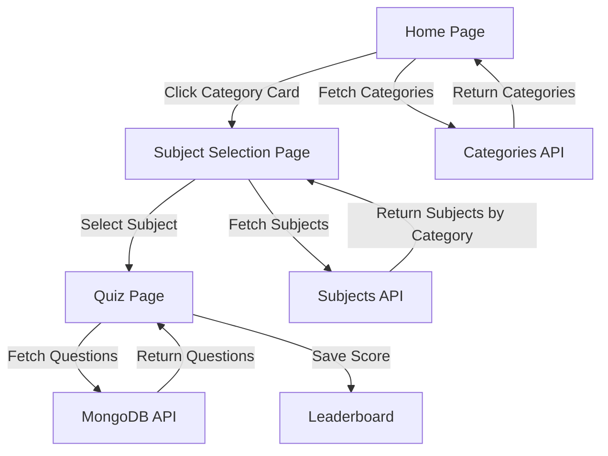
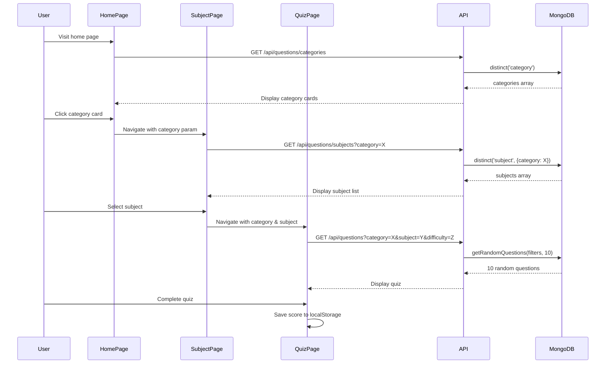

# Design Document: Custom Category Cards

## Overview

This feature enhances the quiz app UI by replacing the Open Trivia Database API category dropdown with custom category cards displayed on the home page. Users will select from five predefined categories (Matric, Intermediate, Programming, Islamic Studies, General Knowledge) presented as Bootstrap cards. Upon selecting a category, users navigate to a subject selection page where they choose a specific subject before starting the quiz. The quiz flow will use MongoDB questions instead of the Open Trivia API, maintaining responsive design and dark mode compatibility.

## Architecture



## Main Workflow



## Components and Interfaces

### Component 1: CategoryCard

**Purpose**: Display a single category as a clickable Bootstrap card

**Interface**:
```javascript
interface CategoryCardProps {
  category: string;
  icon: string;
  description: string;
  onClick: () => void;
}
```

**Responsibilities**:
- Render Bootstrap card with category information
- Handle click events to navigate to subject selection
- Apply hover effects and dark mode styling
- Display category icon and description

### Component 2: HomePage (Modified)

**Purpose**: Display category cards grid instead of dropdown

**Interface**:
```javascript
interface HomePageState {
  playerName: string;
  selectedDifficulty: 'easy' | 'medium' | 'hard';
  categories: string[];
  loading: boolean;
  error: string | null;
}
```

**Responsibilities**:
- Fetch categories from MongoDB API
- Display category cards in responsive grid
- Manage player name input
- Manage difficulty selection
- Navigate to subject selection on category click

### Component 3: SubjectSelectionPage (New)

**Purpose**: Display subjects for selected category

**Interface**:
```javascript
interface SubjectSelectionPageProps {
  searchParams: {
    category: string;
    difficulty: string;
  };
}

interface SubjectSelectionPageState {
  subjects: string[];
  loading: boolean;
  error: string | null;
  category: string;
  difficulty: string;
}
```

**Responsibilities**:
- Fetch subjects based on selected category
- Display subjects as clickable list or cards
- Navigate to quiz page with category, subject, and difficulty
- Show loading and error states
- Provide back navigation to home page

### Component 4: QuizPage (Modified)

**Purpose**: Fetch questions from MongoDB instead of Open Trivia API

**Interface**:
```javascript
interface QuizPageProps {
  searchParams: {
    category?: string;
    subject?: string;
    difficulty: string;
  };
}
```

**Responsibilities**:
- Fetch questions from MongoDB API with category, subject, and difficulty filters
- Display questions with existing quiz logic
- Maintain timer, scoring, and navigation functionality
- Save results to leaderboard with category and subject information

## Data Models

### Model 1: Category

```javascript
interface Category {
  name: string;
  icon: string;
  description: string;
}
```

**Validation Rules**:
- name must be one of: "Matric", "Intermediate", "Programming", "Islamic Studies", "General Knowledge"
- icon must be a valid emoji or icon class
- description must be non-empty string

### Model 2: Question (Existing)

```javascript
interface Question {
  _id: ObjectId;
  category: string;
  subject: string;
  topic: string;
  difficulty: 'easy' | 'medium' | 'hard';
  question: string;
  options: string[];
  correctAnswer: string;
  createdAt: Date;
  updatedAt: Date;
}
```

**Validation Rules**:
- category must match one of the five predefined categories
- subject must be non-empty string
- difficulty must be 'easy', 'medium', or 'hard'
- options must be array of 4 strings
- correctAnswer must be one of the options

### Model 3: QuizParams

```javascript
interface QuizParams {
  category: string;
  subject: string;
  difficulty: 'easy' | 'medium' | 'hard';
}
```

**Validation Rules**:
- All fields are required
- category must be valid category name
- subject must be non-empty string
- difficulty must be valid difficulty level

## Algorithmic Pseudocode

### Main Category Selection Algorithm

```javascript
ALGORITHM displayCategoryCards()
INPUT: None
OUTPUT: Rendered category cards grid

BEGIN
  // Define predefined categories with metadata
  categories ← [
    {name: "Matric", icon: "🎓", description: "Matriculation level questions"},
    {name: "Intermediate", icon: "📚", description: "Intermediate level questions"},
    {name: "Programming", icon: "💻", description: "Programming and coding questions"},
    {name: "Islamic Studies", icon: "☪️", description: "Islamic knowledge questions"},
    {name: "General Knowledge", icon: "🌍", description: "General knowledge questions"}
  ]
  
  // Fetch available categories from MongoDB
  availableCategories ← FETCH("/api/questions/categories")
  
  // Filter predefined categories to show only those with questions
  displayCategories ← []
  FOR each category IN categories DO
    IF category.name IN availableCategories THEN
      displayCategories.add(category)
    END IF
  END FOR
  
  // Render cards in responsive grid
  RENDER Bootstrap grid with displayCategories
  
  RETURN displayCategories
END
```

**Preconditions**:
- MongoDB connection is established
- Questions collection exists with category field
- Player name is entered

**Postconditions**:
- Category cards are displayed in responsive grid
- Only categories with available questions are shown
- Each card is clickable and navigates to subject selection

**Loop Invariants**:
- All processed categories have valid metadata
- displayCategories contains only categories with questions in MongoDB

### Subject Fetching Algorithm

```javascript
ALGORITHM fetchSubjectsByCategory(category)
INPUT: category (string)
OUTPUT: subjects (array of strings)

BEGIN
  ASSERT category IS NOT NULL AND category IS NOT EMPTY
  
  // Validate category is one of predefined categories
  validCategories ← ["Matric", "Intermediate", "Programming", "Islamic Studies", "General Knowledge"]
  IF category NOT IN validCategories THEN
    THROW Error("Invalid category")
  END IF
  
  // Fetch subjects from MongoDB
  subjects ← FETCH("/api/questions/subjects?category=" + category)
  
  // Validate subjects array
  IF subjects IS EMPTY THEN
    THROW Error("No subjects available for this category")
  END IF
  
  ASSERT subjects.length > 0
  
  RETURN subjects
END
```

**Preconditions**:
- category parameter is provided and non-empty
- category is one of the five predefined categories
- MongoDB connection is available

**Postconditions**:
- Returns array of subject strings
- Array contains at least one subject
- All subjects belong to the specified category

**Loop Invariants**: N/A (no loops in this algorithm)

### Quiz Question Fetching Algorithm

```javascript
ALGORITHM fetchQuizQuestions(category, subject, difficulty, limit = 10)
INPUT: category (string), subject (string), difficulty (string), limit (number)
OUTPUT: questions (array of Question objects)

BEGIN
  ASSERT category IS NOT NULL
  ASSERT subject IS NOT NULL
  ASSERT difficulty IN ["easy", "medium", "hard"]
  ASSERT limit > 0
  
  // Build query filters
  filters ← {
    category: category,
    subject: subject,
    difficulty: difficulty
  }
  
  // Fetch random questions from MongoDB
  questions ← FETCH("/api/questions?category=" + category + 
                     "&subject=" + subject + 
                     "&difficulty=" + difficulty + 
                     "&limit=" + limit)
  
  // Validate questions
  IF questions.length = 0 THEN
    THROW Error("No questions available for selected criteria")
  END IF
  
  // Format questions for quiz display
  formattedQuestions ← []
  FOR each q IN questions DO
    ASSERT q.options.length = 4
    ASSERT q.correctAnswer IN q.options
    
    formattedQuestion ← {
      question: q.question,
      correct: q.correctAnswer,
      options: q.options,
      category: q.category,
      subject: q.subject
    }
    
    formattedQuestions.add(formattedQuestion)
  END FOR
  
  ASSERT formattedQuestions.length > 0
  
  RETURN formattedQuestions
END
```

**Preconditions**:
- category, subject, and difficulty are valid and non-null
- limit is positive integer
- MongoDB has questions matching the filters
- Each question has 4 options and a correct answer

**Postconditions**:
- Returns array of formatted question objects
- Each question has shuffled options (handled by existing shuffle utility)
- Array length is min(limit, available questions)
- All questions match the specified filters

**Loop Invariants**:
- All processed questions have exactly 4 options
- correctAnswer is always one of the options
- formattedQuestions contains only valid question objects

## Key Functions with Formal Specifications

### Function 1: handleCategoryClick()

```javascript
function handleCategoryClick(category, difficulty, playerName, router)
```

**Preconditions:**
- category is non-null and valid category name
- difficulty is one of: 'easy', 'medium', 'hard'
- playerName is non-empty string (trimmed)
- router is Next.js router instance

**Postconditions:**
- Player name is saved to localStorage
- Navigation occurs to subject selection page
- URL includes category and difficulty parameters
- No side effects on component state

**Loop Invariants:** N/A

### Function 2: fetchCategories()

```javascript
async function fetchCategories()
```

**Preconditions:**
- MongoDB connection is available
- Questions collection exists

**Postconditions:**
- Returns array of unique category strings
- Array contains only categories with questions in database
- Empty array if no questions exist
- No mutations to database

**Loop Invariants:** N/A

### Function 3: fetchSubjects()

```javascript
async function fetchSubjects(category)
```

**Preconditions:**
- category parameter is provided and non-null
- MongoDB connection is available
- Questions collection exists

**Postconditions:**
- Returns array of unique subject strings for given category
- Array contains only subjects with questions in database
- Empty array if no subjects exist for category
- No mutations to database

**Loop Invariants:** N/A

### Function 4: validateQuizParams()

```javascript
function validateQuizParams(category, subject, difficulty)
```

**Preconditions:**
- Parameters are provided (may be null/undefined)

**Postconditions:**
- Returns boolean indicating validity
- true if and only if all parameters are valid
- No side effects on parameters

**Loop Invariants:** N/A

## Example Usage

### Example 1: Category Card Click Flow

```javascript
// HomePage component
const handleCategoryClick = (categoryName) => {
  if (!playerName.trim()) {
    alert("Please enter your name to start the quiz!");
    return;
  }
  
  // Save player name
  localStorage.setItem("playerName", playerName.trim());
  
  // Navigate to subject selection
  router.push(`/subjects?category=${categoryName}&difficulty=${selectedDifficulty}`);
};

// Render category cards
<div className="row g-3">
  {categories.map((cat) => (
    <div key={cat.name} className="col-md-6 col-lg-4">
      <div 
        className="card h-100 shadow-sm category-card"
        onClick={() => handleCategoryClick(cat.name)}
        style={{ cursor: 'pointer' }}
      >
        <div className="card-body text-center">
          <div className="fs-1 mb-3">{cat.icon}</div>
          <h5 className="card-title">{cat.name}</h5>
          <p className="card-text text-muted">{cat.description}</p>
        </div>
      </div>
    </div>
  ))}
</div>
```

### Example 2: Subject Selection Flow

```javascript
// SubjectSelectionPage component
useEffect(() => {
  async function loadSubjects() {
    try {
      setLoading(true);
      const res = await fetch(`/api/questions/subjects?category=${category}`);
      const data = await res.json();
      
      if (!data.success) {
        throw new Error(data.error);
      }
      
      setSubjects(data.subjects);
    } catch (err) {
      setError(err.message);
    } finally {
      setLoading(false);
    }
  }
  
  loadSubjects();
}, [category]);

const handleSubjectClick = (subject) => {
  router.push(`/quiz?category=${category}&subject=${subject}&difficulty=${difficulty}`);
};
```

### Example 3: Quiz Question Fetching

```javascript
// QuizPage component - Modified fetch logic
useEffect(() => {
  async function fetchQuestions() {
    try {
      setLoading(true);
      
      // Build API URL with MongoDB endpoint
      const params = new URLSearchParams({
        category: categoryParam,
        subject: subjectParam,
        difficulty: difficulty,
        limit: '10'
      });
      
      const res = await fetch(`/api/questions?${params}`);
      const data = await res.json();
      
      if (!data.success) {
        throw new Error(data.error);
      }
      
      const formatted = data.questions.map((q) => ({
        question: q.question,
        correct: q.correctAnswer,
        options: shuffleArray([...q.options]),
        category: q.category,
        subject: q.subject
      }));
      
      setQuestions(formatted);
    } catch (err) {
      setError(err.message);
    } finally {
      setLoading(false);
    }
  }
  
  fetchQuestions();
}, [categoryParam, subjectParam, difficulty]);
```

## Correctness Properties

### Property 1: Category Display Consistency
```javascript
// For all categories displayed on home page:
// ∀ category ∈ displayedCategories: 
//   category ∈ predefinedCategories ∧ 
//   ∃ question ∈ MongoDB: question.category = category.name

assert(displayedCategories.every(cat => 
  predefinedCategories.includes(cat.name) &&
  availableCategories.includes(cat.name)
));
```

### Property 2: Subject-Category Relationship
```javascript
// For all subjects displayed for a category:
// ∀ subject ∈ displayedSubjects(category):
//   ∃ question ∈ MongoDB: 
//     question.category = category ∧ question.subject = subject

assert(subjects.every(subject =>
  questionsExist({ category, subject })
));
```

### Property 3: Quiz Question Validity
```javascript
// For all questions in a quiz:
// ∀ question ∈ quizQuestions:
//   question.category = selectedCategory ∧
//   question.subject = selectedSubject ∧
//   question.difficulty = selectedDifficulty ∧
//   question.options.length = 4 ∧
//   question.correctAnswer ∈ question.options

assert(quizQuestions.every(q =>
  q.category === selectedCategory &&
  q.subject === selectedSubject &&
  q.difficulty === selectedDifficulty &&
  q.options.length === 4 &&
  q.options.includes(q.correctAnswer)
));
```

### Property 4: Navigation State Preservation
```javascript
// When navigating between pages:
// playerName ∧ difficulty ∧ category ∧ subject are preserved

assert(
  localStorage.getItem("playerName") === playerName &&
  searchParams.get("difficulty") === selectedDifficulty &&
  searchParams.get("category") === selectedCategory &&
  searchParams.get("subject") === selectedSubject
);
```

## Error Handling

### Error Scenario 1: No Questions Available for Category

**Condition**: User selects a category that has no questions in MongoDB
**Response**: Display error message on subject selection page
**Recovery**: Provide "Back to Home" button to select different category

### Error Scenario 2: No Subjects Available for Category

**Condition**: Category exists but has no subjects in MongoDB
**Response**: Display informative message "No subjects available for this category"
**Recovery**: Automatically redirect to home page after 3 seconds with notification

### Error Scenario 3: API Connection Failure

**Condition**: MongoDB API request fails due to network or server error
**Response**: Display error alert with retry button
**Recovery**: Allow user to retry request or return to home page

### Error Scenario 4: Invalid Category/Subject Parameters

**Condition**: User navigates with invalid or missing URL parameters
**Response**: Validate parameters and redirect to home page if invalid
**Recovery**: Show notification explaining the issue and prompt to start over

### Error Scenario 5: Empty Player Name

**Condition**: User attempts to select category without entering name
**Response**: Show alert "Please enter your name to start the quiz!"
**Recovery**: Focus on name input field, prevent navigation

## Testing Strategy

### Unit Testing Approach

Test individual components and functions in isolation:

1. **CategoryCard Component**
   - Renders correctly with props
   - Handles click events
   - Applies correct styling for dark mode
   - Displays icon and description

2. **HomePage Component**
   - Fetches categories from API
   - Displays category cards in grid
   - Validates player name before navigation
   - Saves player name to localStorage
   - Handles loading and error states

3. **SubjectSelectionPage Component**
   - Fetches subjects based on category parameter
   - Displays subjects as clickable items
   - Navigates with correct parameters
   - Handles empty subjects array

4. **QuizPage Component**
   - Fetches questions from MongoDB API
   - Formats questions correctly
   - Maintains existing quiz functionality
   - Saves category and subject to leaderboard

5. **API Routes**
   - `/api/questions/categories` returns unique categories
   - `/api/questions/subjects` filters by category
   - `/api/questions` returns random questions with filters

### Property-Based Testing Approach

**Property Test Library**: fast-check (for JavaScript/TypeScript)

1. **Property: Category Filtering**
   - Generate random category names
   - Verify only valid categories are displayed
   - Verify all displayed categories have questions in database

2. **Property: Subject-Category Relationship**
   - Generate random category-subject pairs
   - Verify subjects always belong to their category
   - Verify no orphaned subjects are displayed

3. **Property: Question Filtering**
   - Generate random filter combinations (category, subject, difficulty)
   - Verify all returned questions match filters
   - Verify question count never exceeds requested limit

4. **Property: Navigation Parameter Preservation**
   - Generate random navigation sequences
   - Verify parameters are preserved across page transitions
   - Verify localStorage maintains player name

### Integration Testing Approach

Test complete user flows:

1. **Flow: Category to Quiz**
   - Enter player name
   - Select category card
   - Select subject
   - Verify quiz loads with correct questions
   - Complete quiz and verify score saved

2. **Flow: Error Recovery**
   - Trigger API error
   - Verify error message displayed
   - Click retry button
   - Verify successful recovery

3. **Flow: Back Navigation**
   - Navigate through category → subject → quiz
   - Use back button at each stage
   - Verify state is preserved correctly

## Performance Considerations

1. **Category Card Rendering**
   - Use CSS Grid for responsive layout
   - Implement hover effects with CSS transitions
   - Avoid unnecessary re-renders with React.memo if needed

2. **API Request Optimization**
   - Cache category list in component state
   - Implement loading states to prevent duplicate requests
   - Use SWR or React Query for data fetching (optional enhancement)

3. **Subject List Loading**
   - Show skeleton loaders during fetch
   - Implement debouncing if search functionality added later
   - Limit subject list to reasonable number (paginate if > 50)

4. **Quiz Question Loading**
   - Fetch questions once per quiz session
   - Store in component state to avoid refetching
   - Implement progress saving to localStorage

## Security Considerations

1. **Input Validation**
   - Validate category and subject parameters on server side
   - Sanitize player name input to prevent XSS
   - Validate difficulty parameter against allowed values

2. **API Security**
   - Implement rate limiting on API routes
   - Validate MongoDB queries to prevent injection
   - Return appropriate error messages without exposing internals

3. **Data Privacy**
   - Store player names only in localStorage (client-side)
   - Don't transmit sensitive data in URL parameters
   - Clear quiz progress from localStorage after completion

## Dependencies

1. **Existing Dependencies**
   - Next.js 16 (App Router)
   - React
   - Bootstrap 5
   - MongoDB Atlas
   - Framer Motion (for animations)

2. **No New Dependencies Required**
   - All functionality can be implemented with existing dependencies
   - Bootstrap provides card and grid components
   - Next.js router handles navigation
   - MongoDB driver already integrated

3. **Optional Enhancements**
   - SWR or React Query for data fetching optimization
   - React Icons for consistent icon library
   - Lodash for utility functions (if needed)
